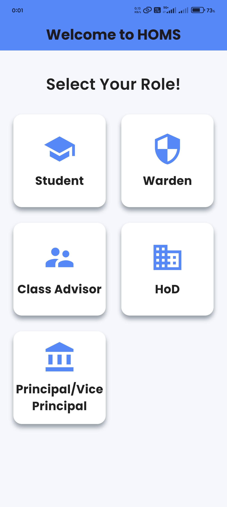

# 📌 HOMS - Hostel Out Pass Management System  

## 📝 About  
HOMS (Hostel Out Pass Management System) is a **Flutter-based mobile application** designed to simplify the process of managing hostel out passes.  
It provides an efficient way for students to request passes and for hostel authorities to review and approve them.  

## 🚀 Features  
- 📝 **Student Pass Request** – Students can apply for an out pass with relevant details.  
- ✅ **Approval System** – Warden/Admin can approve or reject requests.  
- 🔄 **Real-Time Status Updates** – Students get notified about their pass status.  
- 📅 **Pass History Tracking** – View previously approved/rejected passes.  
- 🔐 **Secure Login** – Authentication system for students and staff.  

## 🏗️ Tech Stack  
- **Frontend:** Flutter (Dart)  
- **Backend:** PHP (API)  
- **Database:** MySQL  

## 📂 Project Structure  
- 📁 `Screens/` - Contains all the UI screens of the app.  
- 📄 `main.dart` - Entry point of the application.  
- 📜 **Full Source Code:** If you need the complete source code, visit the **"Full Source Code"** file in this repository.  

---

## 📱 HOMS - Android App Version  

The **Hostel Out Pass Management System (HOMS)** is now available as an **Android application**, designed to streamline the process of managing student out passes efficiently.  

### 🚧 Current Development Status  
The Android app is still under development, and the following features are yet to be implemented:  
- 📝 **Apply Pass** – Allow students to submit out pass requests from the app.  
- 👤 **Profile View** – Enable users to view and update their profile details.  
- ➕ **Add Pass Type, Department, and Student Management** – Administrative functionalities for better user control.  

These features are **fully functional in the Web App version** and will be added to the Android app soon.  

### 🌐 Web App Version  
To get a complete understanding of the project and see the full workflow, visit:  
🔗 **[HOMS Web Demo](https://reshist.me/homs_demo)**  

Stay tuned for upcoming updates! 🚀  

Sample

